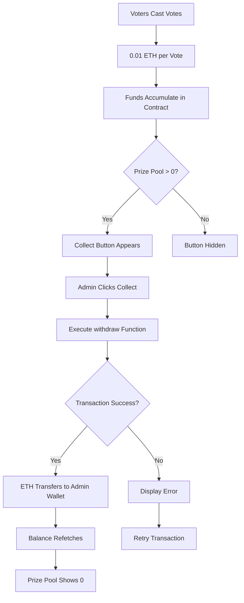

## Prize Pool Mechanics

VoteLab accumulates ETH from voter entry fees in the smart contract. Each vote requires a 0.01 ETH payment:

```typescript
// From useMemberVote.ts:70-78
const castVote = (option: number) => {
  writeContract({
    address: ContractAddress,
    abi: ABI,
    functionName: "vote",
    args: [BigInt(option)],
    value: parseEther("0.01"),
  });
};
```

<Note>
  The entry fee is hardcoded at 0.01 ETH per vote. All payments accumulate in the contract until you withdraw them.
</Note>

## Monitoring the Prize Pool

The admin panel displays the current contract balance in real-time:

```typescript
// From useMemberVote.ts:14-16
const { data: balanceData, refetch: refetchBalance } = useBalance({
  address: ContractAddress,
});
```

The balance converts from Wei to ETH for display:

```typescript
// From useMemberVote.ts:103
prizePool: balanceData ? formatEther(balanceData.value) : "0",
```

### Prize Pool Display

When funds are available, the withdrawal button shows the exact amount:

```tsx
// From AdminPanel.tsx:53-62
{parseFloat(prizePool) > 0 && (
  <button 
    onClick={withdrawFunds}
    disabled={isPending}
    className="flex items-center gap-2 px-4 py-2 bg-yellow-500/10 hover:bg-yellow-500 text-yellow-500 hover:text-black rounded-lg text-[10px] font-black uppercase tracking-widest transition-all active:scale-95 border border-yellow-500/20"
  >
    <Wallet className="w-3.5 h-3.5" />
    Collect {prizePool} ETH
  </button>
)}
```

<Warning>
  The withdrawal button only appears when `prizePool > 0`. You cannot withdraw from an empty contract.
</Warning>

## Withdrawing Funds

As the contract owner, you can withdraw accumulated ETH at any time using the `withdraw()` function.

### Function Implementation

```typescript
// From useMemberVote.ts:62-68
const withdrawFunds = () => {
  writeContract({
    address: ContractAddress,
    abi: ABI,
    functionName: "withdraw",
  });
};
```

### Contract Function Signature

```json
{
  "type": "function",
  "name": "withdraw",
  "inputs": [],
  "outputs": [],
  "stateMutability": "nonpayable"
}
```

<Note>
  The function name in the contract is `withdraw`, but the hook exposes it as `withdrawFunds` for clarity in the application layer.
</Note>

## Withdrawal Process

<Steps>
  <Step title="Verify Balance">
    Confirm the prize pool display shows available funds greater than 0 ETH
  </Step>
  <Step title="Click Collect Button">
    Execute the `withdrawFunds()` transaction by clicking the yellow "Collect" button
  </Step>
  <Step title="Transaction Pending">
    Wait for blockchain confirmation (button shows spinner during `isPending` state)
  </Step>
  <Step title="Funds Transfer">
    Contract transfers entire balance to your connected admin wallet
  </Step>
  <Step title="Balance Update">
    Prize pool display refreshes to 0 ETH, and the collect button disappears
  </Step>
</Steps>

## Error Handling

The contract includes withdrawal-specific error handling:

```json
// From ABI constants
{
  "type": "error",
  "name": "MemberVote__WithdrawFailed",
  "inputs": []
}
```

This error triggers if the ETH transfer fails during withdrawal execution.

### Common Failure Scenarios

<AccordionGroup>
  <Accordion title="Insufficient Gas">
    Your admin wallet lacks ETH to pay transaction gas fees. Add ETH to your wallet before attempting withdrawal.
  </Accordion>
  <Accordion title="Not Contract Owner">
    You're connected with a non-owner address. The `MemberVote__NotOwner` error prevents unauthorized withdrawals.
  </Accordion>
  <Accordion title="Empty Balance">
    No funds exist in the contract. The UI prevents this by hiding the button when `prizePool` equals 0.
  </Accordion>
  <Accordion title="Network Issues">
    RPC connection problems or network congestion can cause transaction failures. Retry after connectivity improves.
  </Accordion>
</AccordionGroup>

## Balance Auto-Refresh

After successful withdrawals, the system automatically refetches the contract balance:

```typescript
// From useMemberVote.ts:80-89
useEffect(() => {
  if (txSuccess) {
    refetchStatus();
    refetchElectionId();
    refetchUserStatus();
    refetchA();
    refetchB();
    refetchBalance(); // Updates prize pool display
  }
}, [txSuccess, refetchStatus, refetchElectionId, refetchUserStatus, refetchA, refetchB, refetchBalance]);
```

You don't need to manually refresh the page to see updated balances.

## Withdrawal Timing Strategies

<CardGroup cols={2}>
  <Card title="After Each Election" icon="calendar-day">
    Withdraw funds immediately after calling `resetVotes()` to minimize contract holdings
  </Card>
  <Card title="Periodic Batch" icon="calendar-week">
    Allow funds to accumulate across multiple elections, then withdraw in larger batches to save gas
  </Card>
  <Card title="Milestone-Based" icon="flag">
    Set withdrawal thresholds (e.g., every 1 ETH) to balance security and efficiency
  </Card>
  <Card title="On-Demand" icon="hand-pointer">
    Withdraw only when you need to access the funds for operational expenses
  </Card>
</CardGroup>

## Security Considerations

<Warning>
  Only the contract owner address can withdraw funds. Never share your admin wallet private keys or seed phrase.
</Warning>

### Owner-Only Access

The contract enforces ownership checks on the withdrawal function:

```typescript
// From useMemberVote.ts:104
isOwner: address?.toLowerCase() === (ownerAddress as string)?.toLowerCase()
```

Attempting withdrawal from non-owner addresses triggers:

```json
{
  "type": "error",
  "name": "MemberVote__NotOwner",
  "inputs": []
}
```

## Gas Cost Optimization

Withdrawal transactions consume gas, which you pay from your admin wallet:

```typescript
// From useMemberVote.ts:10
const { writeContract, data: hash, isPending, error } = useWriteContract();
```

<Tip>
  Monitor network gas prices and withdraw during low-congestion periods to minimize transaction costs.
</Tip>

### Gas Estimation

Typical withdrawal gas costs:

- **Low congestion**: 0.0001-0.0005 ETH
- **Medium congestion**: 0.0005-0.002 ETH  
- **High congestion**: 0.002-0.01+ ETH

Batch withdrawals after accumulating significant funds to improve gas efficiency relative to total withdrawn amount.

## Transaction Receipt

The hook provides transaction hash for on-chain verification:

```typescript
// From useMemberVote.ts:12
const { isSuccess: txSuccess } = useWaitForTransactionReceipt({ hash });
```

You can view withdrawal transactions on blockchain explorers using the returned hash.

## Complete Withdrawal Workflow



## Best Practices

<Steps>
  <Step title="Regular Monitoring">
    Check prize pool balances frequently during active voting sessions
  </Step>
  <Step title="Secure Wallet">
    Use hardware wallet or secure key management for admin address
  </Step>
  <Step title="Transaction Records">
    Maintain records of withdrawal hashes for accounting and auditing
  </Step>
  <Step title="Gas Budget">
    Keep sufficient ETH in admin wallet to cover withdrawal transaction fees
  </Step>
  <Step title="Timing Strategy">
    Develop a consistent withdrawal schedule that balances security and efficiency
  </Step>
</Steps>

## Next Steps

<Card title="Managing Elections" icon="ballot-check" href="/admin/managing-elections">
  Return to election management to learn about starting and closing voting sessions
</Card>