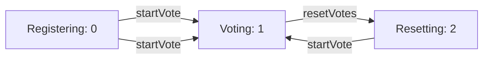
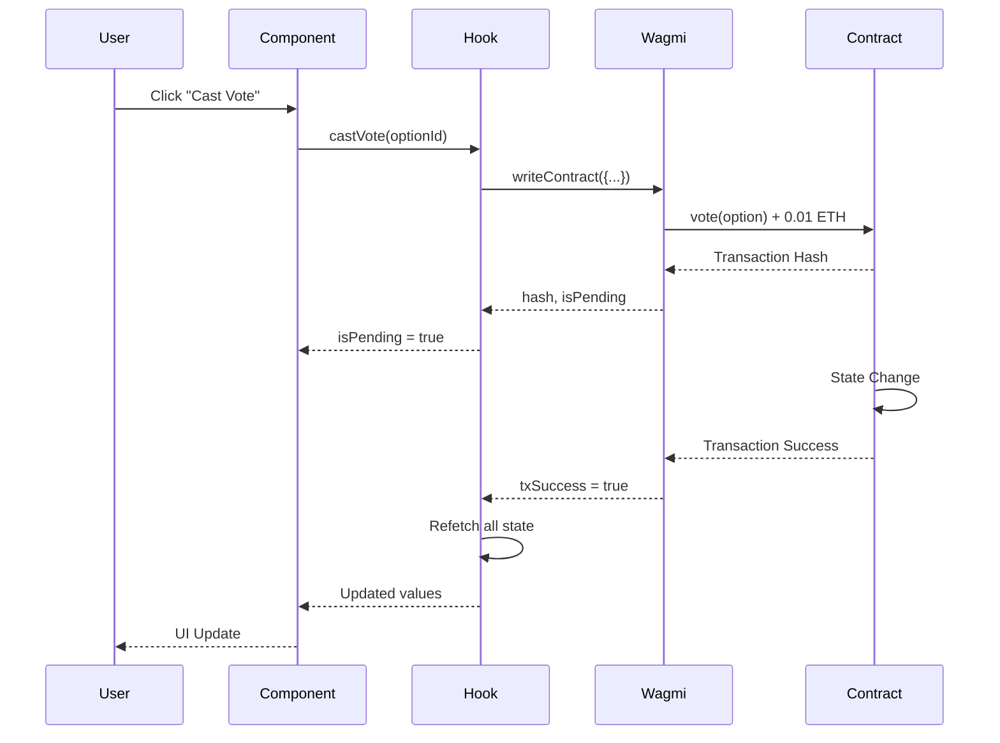

VoteLab is built on a three-layer architecture that ensures security, transparency, and maintainability. You'll interact with a Solidity smart contract, a type-safe frontend hook, and a React component layer.

## Finite State Machine Model

The contract operates on a strict **Finite State Machine** (FSM) that prevents invalid state transitions. This design ensures that voting operations only occur during the appropriate workflow phase.

<Note>
  The state machine is immutable during execution. Once a state transition begins, it must complete before another can be initiated.
</Note>

### State Flow Diagram



### State Enumeration

The contract defines states using a Solidity enum:

```solidity
enum WorkFlowStation {
    Registering,  // 0: Preparation phase
    Voting,       // 1: Active voting
    Resetting     // 2: Results locked
}
```

You can query the current state using the `getWorkflowStation` function, which returns a `uint8` value (0, 1, or 2).

## Contract Design

### Core State Variables

The VoteLab contract maintains minimal state to reduce gas costs:

- **Owner address**: Immutable after deployment (set in constructor)
- **Entry fee**: Immutable entry cost to prevent manipulation
- **Vote counters**: `optionAVotes` and `optionBVotes`
- **Voter registry**: Array of addresses that have voted
- **Vote mapping**: `addressVoted` maps each address to their election ID
- **Election ID**: Increments with each new election cycle

### Available Functions

<Tabs>
  <Tab title="View Functions">
    These functions read blockchain state without modifying it:

    ```typescript
    // Get current workflow state (0, 1, or 2)
    getWorkflowStation() returns (uint8)

    // Get vote counts
    getOptionAVotes() returns (uint256)
    getOptionBVotes() returns (uint256)

    // Check if address voted in current election
    addressVoted(address voter) returns (uint256)

    // Get contract owner
    getOwner() returns (address)

    // Get all voters in current election
    getVoters() returns (address[])

    // Get current election cycle ID
    getElectionId() returns (uint256)
    ```
  </Tab>
  <Tab title="State-Changing Functions">
    These functions modify blockchain state and require gas:

    ```solidity
    // Cast a vote (requires entry fee payment)
    vote(uint256 option) payable

    // Start new election [onlyOwner]
    startVote()

    // Close election and lock results [onlyOwner]
    resetVotes()

    // Withdraw collected fees [onlyOwner]
    withdraw()
    ```
  </Tab>
</Tabs>

### Custom Errors

The contract uses custom errors for gas-efficient reverts:

```typescript
// From src/constants/index.ts
{
  "type": "error",
  "name": "MemberVote__AlreadyVoted",
  "inputs": []
},
{
  "type": "error",
  "name": "MemberVote__InvalidEntryFee",
  "inputs": []
},
{
  "type": "error",
  "name": "MemberVote__InvalidOption",
  "inputs": []
},
{
  "type": "error",
  "name": "MemberVote__NotOwner",
  "inputs": []
},
{
  "type": "error",
  "name": "MemberVote__WithdrawFailed",
  "inputs": []
},
{
  "type": "error",
  "name": "MemberVote__WrongWorkflowStation",
  "inputs": []
}
```

<Warning>
  Handle these errors in your frontend to provide meaningful user feedback. The `useMemberVote` hook exposes an `error` object for this purpose.
</Warning>

## Frontend Integration

### The useMemberVote Hook

VoteLab provides a custom React hook that abstracts Web3 complexity. This hook handles contract interactions, state management, and transaction tracking.

#### Hook Architecture

```typescript
// From src/hooks/useMemberVote.ts:8-11
export const useMemberVote = () => {
    const { address, isConnected } = useAccount();
    const { writeContract, data: hash, isPending, error } = useWriteContract();
    const { isSuccess: txSuccess } = useWaitForTransactionReceipt({ hash });
```

The hook uses Wagmi v2 for type-safe contract interactions:

<Accordion title="View Functions Integration">
  ```typescript
  // src/hooks/useMemberVote.ts:18-44
  const { data: workflowStation, refetch: refetchStatus } = useReadContract({
      address: ContractAddress, abi: ABI, functionName: "getWorkflowStation",
  });

  const { data: electionId, refetch: refetchElectionId } = useReadContract({
      address: ContractAddress, abi: ABI, functionName: "getElectionId",
  });

  const { data: ownerAddress } = useReadContract({
      address: ContractAddress, abi: ABI, functionName: "getOwner",
  });

  const { data: userVotedId, refetch: refetchUserStatus } = useReadContract({
      address: ContractAddress,
      abi: ABI,
      functionName: "addressVoted",
      args: [address!],
      query: { enabled: !!address }
  });

  const { data: optionAVotes, refetch: refetchA } = useReadContract({
      address: ContractAddress, abi: ABI, functionName: "getOptionAVotes",
  });

  const { data: optionBVotes, refetch: refetchB } = useReadContract({
      address: ContractAddress, abi: ABI, functionName: "getOptionBVotes",
  });
  ```
</Accordion>

<Accordion title="Write Functions Integration">
  ```typescript
  // src/hooks/useMemberVote.ts:46-78
  const startVote = () => {
      writeContract({
          address: ContractAddress,
          abi: ABI,
          functionName: "startVote",
      });
  };

  const resetVotes = () => {
      writeContract({
          address: ContractAddress,
          abi: ABI,
          functionName: "resetVotes",
      });
  };

  const withdrawFunds = () => {
      writeContract({
          address: ContractAddress,
          abi: ABI,
          functionName: "withdraw",
      });
  };

  const castVote = (option: number) => {
      writeContract({
          address: ContractAddress,
          abi: ABI,
          functionName: "vote",
          args: [BigInt(option)],
          value: parseEther("0.01"),
      });
  };
  ```
</Accordion>

#### Automatic State Synchronization

The hook automatically refetches all contract state after successful transactions:

```typescript
// src/hooks/useMemberVote.ts:80-89
useEffect(() => {
    if (txSuccess) {
        refetchStatus();
        refetchElectionId();
        refetchUserStatus();
        refetchA();
        refetchB();
        refetchBalance();
    }
}, [txSuccess, refetchStatus, refetchElectionId, refetchUserStatus, refetchA, refetchB, refetchBalance]);
```

<Note>
  This ensures your UI always reflects the current blockchain state without manual refetch calls.
</Note>

### Component Layer

Components consume the `useMemberVote` hook to render state-dependent UI. The AdminPanel component demonstrates this pattern:

```typescript
// src/components/AdminPanel.tsx:8-12
export const AdminPanel = () => {
  const { 
    workflowStation, prizePool, isOwner, 
    startVote, resetVotes, withdrawFunds, isPending 
  } = useMemberVote();

  if (!isOwner) return null;
```

The component uses the `isOwner` check (src/hooks/useMemberVote.ts:104) to conditionally render admin controls:

```typescript
// src/hooks/useMemberVote.ts:104
isOwner: address?.toLowerCase() === (ownerAddress as string)?.toLowerCase(),
```

## Technology Stack

| Layer | Technologies |
| :--- | :--- |
| **Smart Contract** | Solidity v0.8.18, Foundry |
| **Frontend Framework** | Next.js 16 (App Router), TypeScript |
| **Web3 Integration** | Wagmi v2, Viem, ConnectKit/RainbowKit |
| **Styling** | Tailwind CSS, Lucide React, Framer Motion |
| **Unit Testing** | Vitest, React Testing Library |

## Data Flow



## Best Practices

<Steps>
  <Step title="Always check workflowStation">
    Verify the contract is in the correct state before calling state-changing functions. The contract will revert with `MemberVote__WrongWorkflowStation` if the state is invalid.
  </Step>
  <Step title="Handle loading states">
    Use the `isPending` flag from the hook to disable UI elements during transaction processing.
  </Step>
  <Step title="Implement error handling">
    The hook exposes an `error` object. Parse this to show user-friendly error messages.
  </Step>
  <Step title="Leverage automatic refetching">
    Trust the hook's `useEffect` to update state after transactions. Avoid manual refetch calls unless necessary.
  </Step>
</Steps>

## Next Steps

<CardGroup cols={2}>
  <Card title="Workflow States" icon="diagram-project" href="/concepts/workflow-states">
    Learn the detailed behavior of each state in the finite state machine
  </Card>
  <Card title="Security Model" icon="shield-halved" href="/concepts/security-model">
    Understand access control, entry fees, and attack prevention mechanisms
  </Card>
</CardGroup>