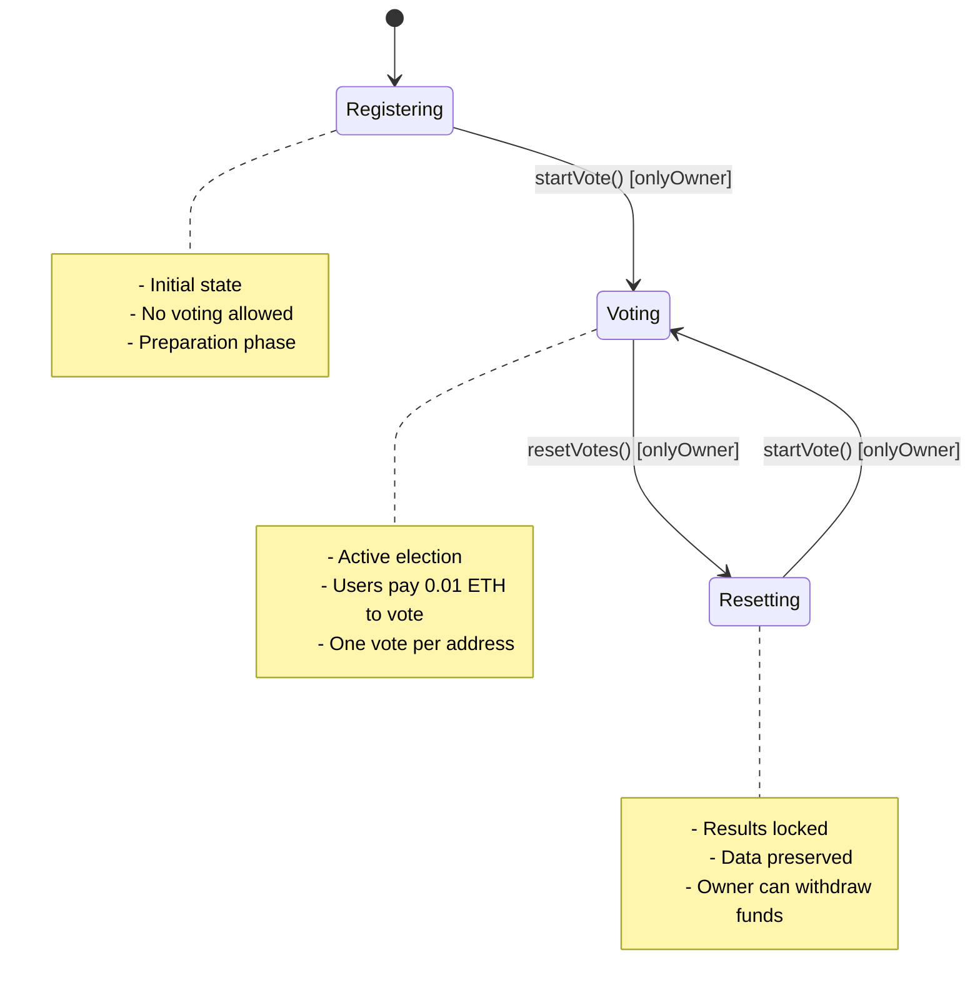

VoteLab uses a **WorkFlowStation** enum to enforce strict state transitions. Each state has specific allowed operations, and attempting to call functions in the wrong state triggers a `MemberVote__WrongWorkflowStation` error.

## State Overview

<CardGroup cols={3}>
  <Card title="Registering" icon="clipboard-list" color="#6366f1">
    **State: 0**  
    Preparation phase. Voting is disabled. Owner prepares the election.
  </Card>
  <Card title="Voting" icon="check-to-slot" color="#22c55e">
    **State: 1**  
    Active election. Users cast votes by paying the entry fee.
  </Card>
  <Card title="Resetting" icon="chart-simple" color="#f59e0b">
    **State: 2**  
    Results locked. Data preserved for visualization before clearing.
  </Card>
</CardGroup>

## State: Registering (0)

### Description

The **Registering** state is the entry point for new elections. This is the default state when the contract is first deployed. During this phase, the owner prepares the proposal and cannot accept votes from users.

<Warning>
  Attempting to call `vote()` in this state will revert with `MemberVote__WrongWorkflowStation`.
</Warning>

### Allowed Operations

| Function | Caller | Purpose |
|----------|--------|----------|
| `startVote()` | Owner only | Transition to Voting state |
| `getWorkflowStation()` | Anyone | Query current state |
| `getOwner()` | Anyone | Verify owner address |

### State Transition

When the owner calls `startVote()`, the contract:

1. Clears the `voters` array from any previous election
2. Resets `optionAVotes` and `optionBVotes` to 0
3. Increments the `electionId` counter
4. Changes state to **Voting (1)**

### Frontend Implementation

The AdminPanel component conditionally renders the "Open Polls" button when in Registering state:

```typescript
// src/components/AdminPanel.tsx:31-40
{(workflowStation === WORKFLOW.REGISTERING || workflowStation === WORKFLOW.RESETTING) && (
  <button 
    onClick={startVote}
    disabled={isPending}
    className="group flex items-center gap-2 px-4 py-2 bg-emerald-500/10 hover:bg-emerald-500 text-emerald-400 hover:text-black rounded-lg text-[10px] font-black uppercase tracking-widest transition-all active:scale-95 disabled:opacity-50"
  >
    {isPending ? <Loader2 className="w-3.5 h-3.5 animate-spin" /> : <Play className="w-3.5 h-3.5 fill-current" />}
    Open Polls
  </button>
)}
```

<Note>
  The button is available in both `REGISTERING` and `RESETTING` states, allowing the owner to start a new election cycle after results are tallied.
</Note>

### Hook Integration

You can check the workflow state using the `useMemberVote` hook:

```typescript
const { workflowStation } = useMemberVote();

if (workflowStation === 0) {
  // In Registering state
  // Disable voting UI, show preparation message
}
```

The hook converts the raw `uint8` value to a JavaScript number:

```typescript
// src/hooks/useMemberVote.ts:100
workflowStation: workflowStation !== undefined ? Number(workflowStation) : 0,
```

## State: Voting (1)

### Description

The **Voting** state is the active election phase. Users can cast votes by calling the `vote()` function with the required entry fee. This state is entered after the owner calls `startVote()`.

### Entry Fee Requirement

All votes require payment of the entry fee (0.01 ETH in the current deployment):

```typescript
// src/hooks/useMemberVote.ts:70-78
const castVote = (option: number) => {
    writeContract({
        address: ContractAddress,
        abi: ABI,
        functionName: "vote",
        args: [BigInt(option)],
        value: parseEther("0.01"),
    });
};
```

<Warning>
  If you send an incorrect amount, the contract reverts with `MemberVote__InvalidEntryFee`.
</Warning>

### Allowed Operations

| Function | Caller | Purpose |
|----------|--------|----------|
| `vote(uint256 option)` | Anyone (once) | Cast a vote for option 0 or 1 |
| `resetVotes()` | Owner only | Close election and transition to Resetting |
| `getOptionAVotes()` | Anyone | Query vote count for Option A |
| `getOptionBVotes()` | Anyone | Query vote count for Option B |
| `addressVoted(address)` | Anyone | Check if address voted in current election |

### Voting Constraints

<Accordion title="One Vote Per Address">
  Each address can only vote once per election. The contract tracks this using a mapping:

  ```solidity
  mapping(address => uint256) addressVoted;
  ```

  When you vote, the contract sets `addressVoted[msg.sender] = electionId`. If you attempt to vote again in the same election, the transaction reverts with `MemberVote__AlreadyVoted`.

  The frontend hook calculates this for you:

  ```typescript
  // src/hooks/useMemberVote.ts:91-95
  const hasVoted = isConnected &&
      electionId != null &&
      userVotedId != null
      ? BigInt(electionId.toString()) === BigInt(userVotedId.toString())
      : false;
  ```
</Accordion>

<Accordion title="Valid Options Only">
  The contract only accepts option `0` or `1`. Passing any other value reverts with `MemberVote__InvalidOption`.

  ```typescript
  // Valid
  castVote(0)  // Vote for Option A
  castVote(1)  // Vote for Option B

  // Invalid - will revert
  castVote(2)
  castVote(999)
  ```
</Accordion>

### State Transition

When the owner calls `resetVotes()`, the contract:

1. **Preserves** all vote counts (`optionAVotes`, `optionBVotes`)
2. **Preserves** the `voters` array for data integrity
3. Changes state to **Resetting (2)**

<Note>
  The Resetting state preserves data intentionally. This allows the frontend to display results before the owner clears state for the next election.
</Note>

### Frontend Implementation

The AdminPanel shows a "Close & Tally" button during Voting:

```typescript
// src/components/AdminPanel.tsx:42-51
{workflowStation === WORKFLOW.VOTING && (
  <button 
    onClick={resetVotes}
    disabled={isPending}
    className="group flex items-center gap-2 px-4 py-2 bg-red-500/10 hover:bg-red-500 text-red-400 hover:text-black rounded-lg text-[10px] font-black uppercase tracking-widest transition-all active:scale-95 disabled:opacity-50"
  >
    {isPending ? <Loader2 className="w-3.5 h-3.5 animate-spin" /> : <Square className="w-3.5 h-3.5 fill-current" />}
    Close & Tally
  </button>
)}
```

## State: Resetting (2)

### Description

The **Resetting** state is the results phase. Voting is closed, and all vote counts are locked. This state exists to preserve data for frontend visualization before the owner starts a new election cycle.

<Note>
  This is a **data preservation phase**, not a cleanup phase. The owner can display results to users before clearing state for the next election.
</Note>

### Allowed Operations

| Function | Caller | Purpose |
|----------|--------|----------|
| `startVote()` | Owner only | Clear state and transition to Voting |
| `withdraw()` | Owner only | Collect accumulated entry fees |
| `getOptionAVotes()` | Anyone | Query final vote count for Option A |
| `getOptionBVotes()` | Anyone | Query final vote count for Option B |
| `getVoters()` | Anyone | Query list of all voters |

<Warning>
  Users cannot vote in this state. Attempting to call `vote()` reverts with `MemberVote__WrongWorkflowStation`.
</Warning>

### Winner Determination

The frontend calculates the winner by comparing vote counts:

```typescript
const { optionAVotes, optionBVotes } = useMemberVote();

const winner = optionAVotes > optionBVotes 
  ? "Option A" 
  : optionBVotes > optionAVotes 
    ? "Option B" 
    : "Tie";
```

The hook exposes these values as JavaScript numbers:

```typescript
// src/hooks/useMemberVote.ts:101-102
optionAVotes: optionAVotes ? Number(optionAVotes) : 0,
optionBVotes: optionBVotes ? Number(optionBVotes) : 0,
```

### Fund Withdrawal

The owner can withdraw accumulated entry fees using the `withdraw()` function. The AdminPanel conditionally shows a "Collect" button when the prize pool is non-zero:

```typescript
// src/components/AdminPanel.tsx:53-62
{parseFloat(prizePool) > 0 && (
  <button 
    onClick={withdrawFunds}
    disabled={isPending}
    className="flex items-center gap-2 px-4 py-2 bg-yellow-500/10 hover:bg-yellow-500 text-yellow-500 hover:text-black rounded-lg text-[10px] font-black uppercase tracking-widest transition-all active:scale-95 border border-yellow-500/20"
  >
    <Wallet className="w-3.5 h-3.5" />
    Collect {prizePool} ETH
  </button>
)}
```

The `prizePool` value is the contract's balance formatted as ETH:

```typescript
// src/hooks/useMemberVote.ts:14-16
const { data: balanceData, refetch: refetchBalance } = useBalance({
    address: ContractAddress,
});

// src/hooks/useMemberVote.ts:103
prizePool: balanceData ? formatEther(balanceData.value) : "0",
```

### State Transition

Calling `startVote()` from the Resetting state initiates a new election cycle (same as from Registering state).

## State Transition Diagram



## Error Handling

The contract enforces state-based access control. Here are the errors you may encounter:

<Tabs>
  <Tab title="Wrong State Errors">
    **MemberVote__WrongWorkflowStation**
    
    Occurs when you call a function in an invalid state:
    
    - Calling `vote()` in Registering or Resetting state
    - Calling `startVote()` in Voting state (must close first)
    - Calling `resetVotes()` in Registering or Resetting state
  </Tab>
  <Tab title="Access Control Errors">
    **MemberVote__NotOwner**
    
    Occurs when a non-owner calls an admin function:
    
    - `startVote()`
    - `resetVotes()`
    - `withdraw()`
  </Tab>
  <Tab title="Voting Errors">
    **MemberVote__AlreadyVoted**  
    User already voted in the current election cycle.
    
    **MemberVote__InvalidOption**  
    Vote option is not 0 or 1.
    
    **MemberVote__InvalidEntryFee**  
    Sent value does not match the required entry fee.
  </Tab>
</Tabs>

## Best Practices

<Steps>
  <Step title="Query state before actions">
    Always check `workflowStation` before calling state-changing functions to provide better UX:
    
    ```typescript
    const { workflowStation, castVote } = useMemberVote();
    
    const handleVote = (option: number) => {
      if (workflowStation !== 1) {
        alert("Voting is not currently open");
        return;
      }
      castVote(option);
    };
    ```
  </Step>
  <Step title="Check hasVoted status">
    Use the `hasVoted` flag to disable voting UI after a user votes:
    
    ```typescript
    const { hasVoted } = useMemberVote();
    
    <button disabled={hasVoted}>
      {hasVoted ? "Already Voted" : "Cast Vote"}
    </button>
    ```
  </Step>
  <Step title="Handle state transitions gracefully">
    The hook automatically refetches state after transactions. Ensure your UI reacts to these changes:
    
    ```typescript
    useEffect(() => {
      if (workflowStation === 2) {
        // Show results UI
      }
    }, [workflowStation]);
    ```
  </Step>
</Steps>

## Testing State Transitions

VoteLab includes comprehensive tests for state machine logic. From the README:

> **State Checks**: Ensures `optionAVotes` and `optionBVotes` are preserved during the `Resetting` phase.

You can test state transitions using Foundry:

```bash
cd contracts
forge test --match-contract StateTransitionTest
```

## Next Steps

<CardGroup cols={2}>
  <Card title="Security Model" icon="shield-halved" href="/concepts/security-model">
    Learn how VoteLab prevents unauthorized access and sybil attacks
  </Card>
  <Card title="Architecture" icon="sitemap" href="/concepts/architecture">
    Explore the full system architecture and integration patterns
  </Card>
</CardGroup>